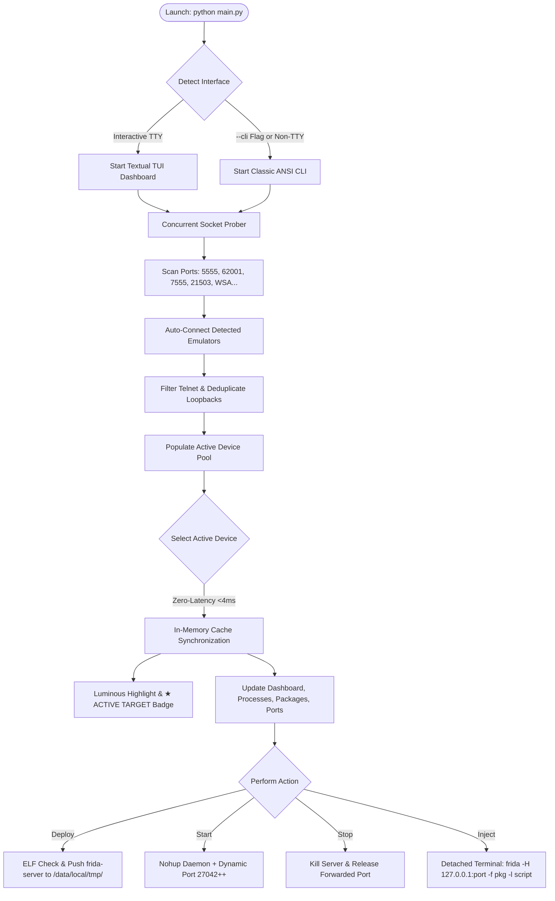

# ⚡ Frida-XTr v2.0
### *Next-Generation Multi-Device & Multi-Emulator Frida Management Suite*

[](https://www.python.org/)
[](https://github.com/joelindra/Frida-xTR)
[](https://frida.re/)
[](https://textual.textualize.io/)
[](LICENSE)

---

> [!WARNING]
> ### ⚠️ Crucial Prerequisites & Setup Notice (Please Read Before Use)
> **Frida-XTr v2.0** automates deployment, dynamic port forwarding, and injection, but depends on essential external tools that must be installed on your machine. Please ensure the following components are ready before launching:
>
> 1. **Android Debug Bridge (ADB)** *(Mandatory)*:
>    - `adb` must be installed and registered in your system's global `PATH`.
>    - Verify by running `adb version` in your terminal. If missing, download [Android SDK Platform-Tools](https://developer.android.com/tools/releases/platform-tools) and add the folder to your Environment Variables (`PATH`).
>
> 2. **Frida Server Binaries** *(Mandatory for Server Deployment)*:
>    - Download the corresponding `frida-server` binary for your target architecture from official [Frida Releases](https://github.com/frida/frida/releases) (e.g. `frida-server-16.x.x-android-x86_64.xz`).
>    - Unpack and place the binaries into the `server/` directory renamed as follows:
>      - `server/frida-server-x86_64` (for 64-bit emulators like Android Studio AVD, Genymotion)
>      - `server/frida-server-x86` (for 32-bit emulators like LDPlayer, Nox)
>      - `server/frida-server-arm64` (for modern ARM64 physical phones)
>      - `server/frida-server-arm` (for older 32-bit ARM physical devices)
>
> 3. **rootAVD** *(Optional — Only Required for Android Studio AVD Rooting)*:
>    - Third-party rooting scripts are **not bundled** in this repository.
>    - If you are running an Android Studio AVD with a "Google Play" production image and wish to gain root access via Magisk, please download or clone [rootAVD by newbit1](https://github.com/newbit1/rootAVD) and place the `rootAVD` folder inside the project root directory.
>    - *(Note: Emulators like LDPlayer, NoxPlayer, and MEmu already provide built-in one-click root toggles in their configuration menus and do NOT require rootAVD!)*
>
> 4. **Python Dependencies** *(Mandatory)*:
>    - Python 3.10 or higher is required.
>    - Run `pip install -r requirements.txt` to install `frida`, `frida-tools`, `rich`, and `textual`.

---

## 🌟 Overview

**Frida-XTr v2.0** is an enterprise-grade, high-performance orchestration tool designed for reverse engineers, penetration testers, and security researchers working with Android devices and emulators. 

Engineered from the ground up by **Anonre**, version 2.0 introduces a modular Python engine, an ultra-smooth terminal user interface (TUI) powered by Textual, zero-latency in-memory state switching, and concurrent auto-discovery across multiple physical devices and virtual emulators simultaneously.

Whether managing a single phone over USB/WiFi or an entire testbed of parallel emulators (LDPlayer, Nox, Android Studio AVD, BlueStacks, MEmu, MuMu, WSA), Frida-XTr automates architecture detection, binary deployment, root elevation, dynamic port forwarding, and script injection through an intuitive dashboard.

---

## ✨ Key Features in v2.0

### 🖥️ Dual Modern Interfaces
- **Interactive Textual TUI (`main.py` or `--tui`)**: Compact, keyboard-driven dashboard with real-time process exploration, package browsing, dynamic port management, and single-click Frida script injection.
- **Classic ANSI CLI (`--cli`)**: Streamlined color-coded menu interface with ANSI styling for lightweight or legacy terminal environments.
- **Automatic Environment Detection**: Intelligently selects the rich TUI on interactive terminals or gracefully falls back to the CLI.

### ⚡ Ultra-Smooth & Anti-Lag Switching Pipeline
- **Sub-4ms In-Memory Tab Switching**: Device switching operates entirely on cached memory models (`DeviceInfo`, `_device_processes`, `_device_packages`, `_device_ports_cache`), avoiding UI thread blocking from synchronous ADB subprocesses or network delays.
- **Luminous Active Target Overlay**: Eye-catching visual framing with deep cyan backgrounds (`#092c42`), emerald left accent borders (`#10b981`), glowing cyan framing (`#0284c7`), and clear `★ ACTIVE TARGET` status badges.
- **Synchronized Multi-Tab State**: Switching an active emulator instantaneously updates the Dashboard specs, Process Explorer, Script Injector, Port Management table, and top statistics banner.

### 🔍 Multi-Emulator Auto-Discovery
- **Concurrent TCP Probing**: Ultra-fast socket scanning (~40ms) automatically detects and establishes ADB connections to running instances across all major emulators:
  - **LDPlayer** (`5555`)
  - **NoxPlayer** (`62001`, `52001`)
  - **MEmu Play** (`21503`)
  - **MuMu Player** (`7555`)
  - **BlueStacks** (Dynamic local ports)
  - **Windows Subsystem for Android (WSA)** (`58526`)
- **QEMU Telnet Filtering**: Explicitly skips Telnet console control ports (`5554`, `5556`, etc.) to prevent offline phantom devices from cluttering ADB.
- **Smart Loopback Deduplication**: Intelligently unifies duplicate device IDs (e.g., `127.0.0.1:5555` vs `emulator-5554`) while keeping distinct hardware emulators safely separated.

### 🚀 Zero-Friction Frida Deployment
- **Binary ELF Header Inspection**: Directly reads 20-byte ELF machine type headers (`0x03` x86, `0x3E` x86_64, `0x28` arm, `0xB7` arm64) to ensure exact binary matching against device ABIs.
- **Automated Push & Chmod**: Deploys `frida-server` to `/data/local/tmp/`, grants `755` permissions, and applies SELinux permissive mode (`setenforce 0`) when root is available.
- **Conflict Prevention**: Gracefully kills lingering server processes with `pkill -9 frida-server` prior to startup to eliminate `Text file busy` locks.
- **Non-Blocking Status Caching**: High-efficiency TTL-based caching (`_FRIDA_STATUS_CACHE`) allows instant UI daemon status queries (0.0003ms) without spawning heavy adb commands.

### 🌐 Dynamic Port Forwarding
- **Conflict-Free Dynamic Ports**: Automatically assigns isolated local host ports starting from `27042`, `27043`, `27044`... to prevent port collisions when controlling multiple emulators simultaneously.
- **Active Target Highlighting**: The port forwarding view immediately flags the selected active target with visual badges.

### 💉 Comprehensive Script Injection
- **Single-Click Execution**: Unified `▶ Launch Frida Injection` button triggers early-stage instrumentation.
- **3-Tier Package Discovery**: Resolves installed packages via Frida API, `frida-ps -ai`, or native Android package manager fallback.
- **Dual Script Support**:
  - **Local Hooks**: Loads `.js` scripts directly from the `scripts/` directory (e.g. `scripts/ssl-pinning.js`).
  - **Frida Codeshare**: Curated presets for popular scripts (Universal SSL Pinning Bypass, Root Detection Bypass, Anti-Frida Bypass, etc.) or custom user-provided slugs.
- **Live Command Preview**: Displays the exact `frida -H 127.0.0.1:<port> -f <package> -l <script>` command before running.
- **Independent Spawning**: Launches live Frida sessions in detached terminal windows so your main TUI dashboard remains interactive and responsive.

### 🔒 Built-In Rooting Guidance
- **Platform-Specific Guidance**: Tailored rooting instructions for LDPlayer, Nox, MEmu, WSA, and physical hardware.
- **rootAVD Hook**: Automatic integration for Android Studio AVD instances when [rootAVD](https://github.com/newbit1/rootAVD) is placed in the project folder, resolving `ANDROID_HOME` and ramdisk images (`system-images/.../ramdisk.img`).

---

## 🏗️ Architecture & Component Topology

```
Frida-xTR/
├── 📁 core/                     # Modular Core Engine
│   ├── 📄 adb.py                # Multi-emulator auto-discovery, port allocations, ADB execution
│   ├── 📄 frida_engine.py       # Binary ELF parsing, server lifecycle, in-memory daemon status cache
│   ├── 📄 injector.py           # Application enumeration, Codeshare presets, injection launcher
│   ├── 📄 root.py               # Root safety checks, ramdisk locator, rootAVD execution
│   └── 📄 __init__.py           # Package exports & unified API
├── 📁 ui/                       # Modern Interface Layer
│   ├── 📄 tui.py                # Textual TUI dashboard, anti-lag event loop, luminous CSS
│   ├── 📄 console.py            # Classic ANSI interactive terminal CLI
│   ├── 📄 colors.py             # Color palettes & ANSI styling tokens
│   └── 📄 __init__.py           # UI module init
├── 📁 server/                   # Target Frida Server Binaries
│   ├── 📄 frida-server-x86_64   # 64-bit x86 emulators (Android Studio, Genymotion)
│   ├── 📄 frida-server-x86      # 32-bit x86 emulators (Standard LDPlayer, Nox)
│   ├── 📄 frida-server-arm64    # 64-bit ARM physical devices & ARM emulators
│   └── 📄 frida-server-arm      # 32-bit ARM legacy devices
├── 📁 scripts/                  # Custom JavaScript Injection Hooks
│   └── 📄 ssl-pinning.js        # Universal Android SSL Pinning bypass script
├── 📁 rootAVD/                  # [Optional] External rootAVD tool (place here if downloaded)
├── 📄 main.py                   # Unified Launcher & CLI entry point
├── 📄 requirements.txt          # Python dependencies
├── 📄 .gitignore                # Git exclusions (bytecode, virtualenvs, runtime state)
└── 📄 README.md                 # Complete documentation
```

---

## 🗺️ System Logic & Data Pipeline



---

## 📥 Installation

### 1. Prerequisites Check
Ensure `adb` is in your `PATH` and Python 3.10+ is installed:
```bash
adb version
python --version
```

### 2. Clone the Repository
```bash
git clone https://github.com/joelindra/Frida-xTR.git
cd Frida-xTR/Dev
```

### 3. Install Dependencies
```bash
pip install -r requirements.txt
```

### 4. Provide Frida Server Binaries
Download the matching binaries from [Frida Releases](https://github.com/frida/frida/releases) and place them in `server/`:
| Architecture | Binary Name | Typical Target Device |
| :--- | :--- | :--- |
| **x86_64** | `server/frida-server-x86_64` | Android Studio AVD, Genymotion, high-end emulators |
| **x86** | `server/frida-server-x86` | Standard LDPlayer, NoxPlayer, 32-bit emulators |
| **ARM64** | `server/frida-server-arm64` | Modern physical Android devices |
| **ARM** | `server/frida-server-arm` | Older physical Android devices |

---

## 🚀 Usage

### 1. Launch Modern Textual TUI (Default)
```bash
python main.py
```
*Or explicitly force TUI mode:*
```bash
python main.py --tui
```

### 2. Launch Classic ANSI CLI Menu
```bash
python main.py --cli
```

### 3. Check Version
```bash
python main.py -v
```

---

## 🎮 TUI Controls & Keyboard Shortcuts

| Shortcut | Description |
| :--- | :--- |
| `F1` or `1` | Switch to **Dashboard** tab (system specs, hardware properties, quick actions) |
| `F2` or `2` | Switch to **Process Explorer** tab (live running process search & PID lookup) |
| `F3` or `3` | Switch to **Script Injector** tab (one-click hook execution & Codeshare) |
| `F4` or `4` | Switch to **Port Management** tab (forwarding matrix & socket statuses) |
| `F5` or `5` | Switch to **Activity Logs** tab (real-time operation audit stream) |
| `R` | **Refresh** device list, auto-connect emulators, and reload process tables |
| `S` | **Quick Start** Frida Server daemon on currently selected active device |
| `K` | **Quick Stop** Frida Server daemon on currently selected active device |
| `Q` | **Quit** Frida-XTr gracefully |

---

## 📱 Multi-Device & Emulator Guide

Frida-XTr v2.0 is tested and optimized for a wide spectrum of Android environments:

### 1. Android Studio AVD
- **Detection**: Automatically recognized as `emulator-5554`, `emulator-5556`, etc.
- **Rooting**: Use system images with **"Google APIs"** for out-of-the-box root access. If using "Google Play" production images, download [rootAVD](https://github.com/newbit1/rootAVD) into the root folder to utilize the automated rooting assistant on the Dashboard tab.
- **Recommended Binary**: `frida-server-x86_64`.

### 2. Third-Party Android Emulators
- **LDPlayer 9 / 5 / 4**: Enable Root in *Settings > Other > Root Permission*. Auto-detected on port `5555`.
- **NoxPlayer**: Enable Root in *Settings > General > Root*. Auto-detected on port `62001` or `52001`.
- **BlueStacks 5**: Enable *Android Debug Bridge* in *Settings > Advanced*. Auto-detected via local dynamic ports.
- **MEmu Play**: Auto-detected via port `21503`.
- **MuMu Player**: Auto-detected via port `7555`.
- **Windows Subsystem for Android (WSA)**: Auto-detected via port `58526`.

### 3. Physical Devices (USB or WiFi ADB)
- **USB Connection**: Enable *Developer Options* and *USB Debugging* on your phone.
- **Wireless ADB**: Connect via ADB first:
  ```bash
  adb connect <device_ip>:5555
  ```
  Frida-XTr will instantly identify the wireless endpoint and map a distinct forwarding port.

---

## 💉 Script Injection Workflow

1. Select your target device from the sidebar list (indicated by the luminous **`★ ACTIVE TARGET`** overlay).
2. Ensure the Frida Server is **`ONLINE`** (click **`▶ Start Frida`** or press `S`).
3. Switch to the **`💉 Script Injector`** tab (`F3`):
   - **Target Package**: Choose an installed application from the quick dropdown or type custom package name.
   - **Hook Script**: Choose a local script from the `scripts/` folder or select a **Frida Codeshare Preset** (e.g. SSL Pinning Bypass).
   - **Spawn Application**: Keep checked to hook early during application initialization.
4. Click **`▶ Launch Frida Injection`**. A dedicated terminal window will open with the active Frida session, keeping your TUI dashboard responsive.

---

## 🛠️ Troubleshooting

| Issue | Cause | Solution |
| :--- | :--- | :--- |
| **"Text file busy"** | A previous instance of `frida-server` is locking the binary | Click **`■ Stop Frida`** (or press `K`) to execute clean `pkill -9`. Frida-XTr handles this automatically before new setups. |
| **Device unauthorized** | Phone screen waiting for ADB permission prompt | Check device screen and tap *"Always allow from this computer"*. |
| **Architecture mismatch** | 32-bit binary deployed on 64-bit emulator (or vice versa) | Frida-XTr checks ELF headers automatically. Verify matching binary exists in `server/`. |
| **Port already in use** | Stale port forwardings left over from crashed sessions | Switch to the **Port Management** tab (`F4`) and click **`Clear Forwards`**, or restart Frida-XTr. |

---

## 📜 Credits & License

- **Lead Developer & Architect**: **Anonre** ([@joelindra](https://github.com/joelindra)) | **Tuan Hades**
- **Core Technologies**: [Frida](https://frida.re/), [Textual](https://textual.textualize.io/), [Rich](https://github.com/Textualize/rich)
- **License**: Released under the **MIT License**.
